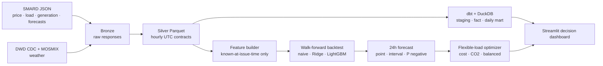

# GridShift DE ⚡

**Next-day German electricity price forecasting and flexible-load scheduling.**

GridShift DE answers a commercial operating question: **when should a factory, EV fleet, or battery consume electricity to reduce cost and emissions?** It combines German power-market data from SMARD/Bundesnetzagentur with DWD weather, compares forecasting models through walk-forward backtesting, and converts the winning forecast into an auditable hourly load plan.

> The repository runs without credentials. `--demo` creates clearly labeled synthetic data so reviewers can exercise the entire product before downloading multi-year source data.

## What is included

- Incremental, retrying ingestion for SMARD hourly prices, load, generation, and day-ahead renewable/load forecasts.
- DWD CDC weather observations plus station-level MOSMIX-L forecasts.
- Bronze source retention, canonical Parquet silver data, DuckDB serving tables, and tested dbt models.
- Leakage-aware features with UTC storage and Europe/Berlin calendar semantics.
- Seasonal-naive, regularized linear, and LightGBM comparisons on expanding time windows with a 24-hour embargo.
- 90% forecast intervals and next-day negative-price probabilities.
- Cost, emissions, and balanced simulations that move 10–20% of demand while conserving energy and enforcing an hourly cap.
- Interactive Streamlit dashboard, Docker image, unit/integration tests, linting, and GitHub Actions CI.

## Quick start

Python 3.10–3.13 is supported.

```bash
python -m venv .venv
# Linux/macOS: source .venv/bin/activate
# Windows PowerShell: .venv\Scripts\Activate.ps1
python -m pip install --upgrade pip
pip install -e ".[all,dev]"

gridshift run --demo --days 730
streamlit run dashboard/app.py
```

Open <http://localhost:8501>. The demo command generates two years of hourly history, runs four backtest folds, fits the best model, forecasts 24 hours, evaluates nine flexibility scenarios, and builds `data/gridshift.duckdb`.

Common development commands:

```bash
pytest
ruff check .
gridshift dbt-build
docker compose up --build
```

## Live-source run

No API keys are required. A two-year backfill is recommended for annual effects and a useful holdout:

```bash
gridshift ingest-smard --start 2024-01-01 --end 2025-12-31
gridshift ingest-dwd --start 2024-01-01 --end 2025-12-31
gridshift train
gridshift simulate
gridshift dbt-build
```

Or orchestrate those stages:

```bash
gridshift run --start 2024-01-01 --end 2025-12-31
```

SMARD forecast series are not available for every historical region/window. Live ingestion is non-strict by default: unavailable optional fields are recorded in `data/bronze/smard/ingestion_metadata.json`; the model then uses explicit week-lag fallbacks. Use `gridshift ingest-smard ... --strict` when completeness is mandatory.

## Architecture



### Data layout

| Layer | Location | Purpose |
|---|---|---|
| Bronze | `data/bronze/` | Immutable SMARD JSON and DWD ZIP/KMZ downloads plus run metadata |
| Silver | `data/silver/` | Canonical hourly energy, weather, and model-feature Parquet files |
| Artifacts | `data/artifacts/` | Model, walk-forward predictions, forecast, and load-shift scenarios |
| Warehouse | `data/gridshift.duckdb` | Lightweight application tables |
| dbt warehouse | `data/gridshift_dbt.duckdb` | Governed staging, intermediate, fact, and daily mart models |

See [the data dictionary](docs/data-dictionary.md) and [architecture decisions](docs/architecture.md).

## Modeling and evaluation

Each backtest fold trains on an expanding historical window, leaves a 24-hour embargo, and evaluates the following 14 days. Model selection uses out-of-sample MAE; RMSE, sMAPE, negative-period precision/recall/F1, and 90% interval coverage are retained for diagnosis. The final model is retrained on all labeled data.

Features are limited to values available when issuing an entire next-day batch:

- hour/week/month cycles and fixed-date holiday proxies;
- price lags at 24, 48, and 168 hours;
- rolling price statistics offset by 24 hours;
- published load and renewable forecasts, with documented week-lag fallbacks;
- DWD temperature, wind, cloud, and radiation forecasts/observations.

Read the [model card](docs/model-card.md) before operational use.

## Flexibility simulation

For each day, an inflexible base remains in every hour. The flexible pool is allocated by price, carbon intensity, or a 55/45 normalized blend. Total MWh is exactly conserved and optimized hourly consumption is capped at 1.6× baseline by default.

The carbon signal is a transparent generation-weighted lifecycle proxy. It is suitable for scenario comparison, not regulated carbon accounting: it excludes imports, grid losses, marginal dispatch, and location-specific power purchase agreements.

## Data sources and attribution

- **Bundesnetzagentur | [SMARD.de](https://www.smard.de/en/downloadcenter/download-market-data)** — German electricity market data, reused under [CC BY 4.0](https://creativecommons.org/licenses/by/4.0/). The client uses the public chart-data responses that power SMARD visualizations.
- **[Deutscher Wetterdienst Open Data](https://opendata.dwd.de/)** — CDC hourly station observations and MOSMIX-L point forecasts. Consult the DWD dataset metadata and terms stored alongside each product for operational redistribution.

Generated data and fitted artifacts are gitignored. The repository never presents demo values as source observations.

## Configuration

Copy `.env.example` to `.env` to override paths, endpoints, timeouts, or seed. Source-series IDs live in `src/gridshift/config.py`; station defaults live in `src/gridshift/ingest/dwd.py`.

Every timestamp key is UTC. German local time is added only for calendar features and presentation, preventing duplicate primary keys during the autumn daylight-saving transition.

## Project status and limitations

This is a decision-support reference implementation, not a trading system. SMARD's website-facing JSON interface can change without versioning. Add source-contract monitoring, scheduled retraining, an experiment registry, alerting, and organization-specific tariffs/constraints before production deployment.

Contributions are welcome; see [CONTRIBUTING.md](CONTRIBUTING.md). Security reports should follow [SECURITY.md](SECURITY.md).

## License

Project code is MIT licensed. Source data retain their original licenses and attribution requirements.

